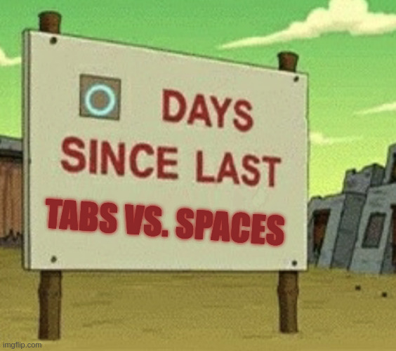

 

## What Are UI Frameworks?
Bootstrap 5 has a learning curve, as many things do, which means it will take time and effort to learn how to use it properly and effectively. But if you do, it will be a game-changer in web development. Instead of spending hours writing CSS to make a button or a navigation bar look good, you can just add a class in your HTML, and boom—done. No more struggling with positioning, margins, and media queries because Bootstrap takes care of all that for you. It makes your website responsive without you having to manually adjust layouts for different screen sizes.

## Are There Benefits? 
If you know anything about web development, you would have heard about HTML and CSS. They are the fundamental building blocks of web pages, but not UI frameworks. UI frameworks like Bootstrap do still use CSS as a base. Now with this, you might be saying, "Why not just use CSS then?" Well, I'll answer that—it's because using UI frameworks such as Bootstrap will save you the hassle of writing multiple lines of code to get this one part of your website to the perfect style that you want. But if you use Bootstrap, you turn 10 lines of code in your CSS file into 1 line of code in your HTML file. This is a MAJOR time saver. Bootstrap automatically adjusts to different screen sizes, which eliminates the need to manually tweak layouts for it to work on multiple devices. Bootstrap also provides pre-made buttons that anyone can use without the requirement of writing HTML and CSS.

## So Should We All Use UI Frameworks? 
But it’s not all perfect. Since Bootstrap is used by so many people, a lot of websites end up looking kind of the same unless you go in and do some extra custom styling. If you want something super unique and custom-made, Bootstrap might not be the best option because you’ll have to override a lot of its styles, which can be annoying. Also, using Bootstrap for really small projects might feel like overkill since it comes with a lot of features you might not even need.

## My Hot Take 
Still, at the end of the day, Bootstrap is definitely worth it if you want to save time and make your website look good without having to write tons of CSS. It’s a great tool for both beginners and experienced developers who just want to get things done fast. So if you're thinking about using Bootstrap, go for it—chances are, it’ll make your life a whole lot easier. The essay above used ChatGPT for spelling and grammar corrections/suggestions, and suggestions for a main essay title. So, is Bootstrap really worth it? Yes—but only if it fits the needs of your project. If you value efficiency, responsiveness, and ease of use, then Bootstrap will make your life a whole lot easier.

*Oh! And of course, the grammar checking and editing is courtesy of the one and only ChatGPT!*
