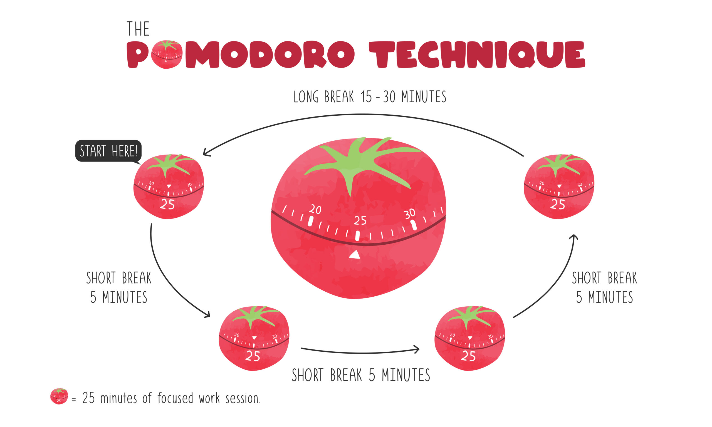

 

Initially, when the effort estimation benchmark were introduced, I approached them with a fair amount of skepticism. I was used to thinking about assignments in terms of completion rather than time, and I assumed that as long as the work got done, the exact number of hours spent was not especially meaningful. However, throughout the final project the process gradually changed how I thought about planning, pacing, and the value of reflecting on my own workflow.

## Projecting Time Estimations

At the beginning of the final project, my effort estimates were largely educated guesses coupled with my intuition. I based them on prior coursework experience with similar frontend and full-stack tasks rather than formal historical data. However, after completing roughly the first milestone, I began to develop informal historical data based on my own work patterns. Noticing the patterns in my completeion rate allowed me to rinse and repeat my estimates for features that had similar components. For example, later on I knew that UI-frontend aspects would take about an hour whereas backend and API routing would take much lnger.

Even if my intial estimates were far from the actual time I spent working on the issues, it was still a good mental reminder of the effort I would need to put in for each issue. One example was Issue-74, which involved finding two community members to review our application and conducting interviews with them. I initially estimated this task would take around 20 to 30 minutes, but it ultimately took closer to 45 minutes. Although the estimate itself was inaccurate, writing it down forced me to recognize that this task required time and coordination with others. Personally, that mental reminder made it far less likely that I would procrastinate or try to squeeze the task in between other responsibilities.

## Tracking Actual Effort

I tracked my actual effort manually by recording start and stop times for work sessions and categorizing time as coding or non-coding. I primarily used my personal discord server as a text-editor for this purpose and occasionally referenced commit timestamps to double check myself. Because I already use the Pomodoro technique in my daily workflow, tracking time felt relatively natural. However, towards the end where I was mostly just trying to get everything done, the lines between which issue I was working on blurred. For example, on 12/10/25 I recorded working on the WarriorHub application for 10 hours but I was a bit lost on which issues took what amount of time as I was hopping around trying to get everything done.

As for AI I did not use it to track effort or the time estimated. I think AI would not be able to understand a person's own workflow as well as an individual could, or at least it shouldn't in my eyes. However, I did use AI for the issues themselves, like ChatGPT was a great help in debugging code or even providing a wireframe mockup of the front-end UI aspects.

## Future Effort Tracking

If I were to repeat this process, I would improve both estimation and tracking by breaking tasks into smaller subtasks as to not repeat my rabbit-hole tendencies. I think even though the time estimates were a good idea, I often got lost in trying to finish the tasks or improve the website as much as I could rather than sticking to just what my issue covered.

The most important takeaway from effort estimation is not precision, but pacing. While exact time predictions are rarely correct, the habit of estimation promotes better time management, which is a skill we can all afford to improve on.

*Oh! And of course, the grammar checking and editing is courtesy of the one and only ChatGPT!*
