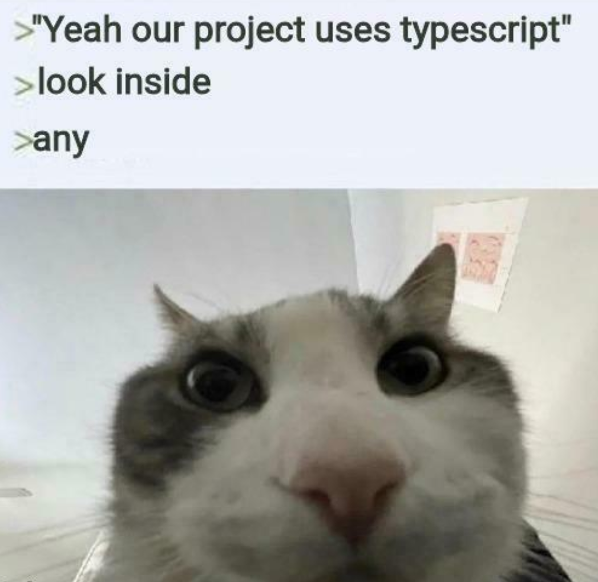

*Oh man! I don't feel like locking in!*

## My Feelings On Typescript

Coming into TypeScript as a complete beginner, I found it both interesting and challenging. Since it’s built on top of JavaScript, a lot of the syntax feels familiar, but the static typing aspect is tough for me. I’m used to writing code more freely, so having to stop and think carefully about the types of variables and function inputs adds an extra layer of difficulty. At times it feels like it slows me down, but I can see how it forces me to be more precise and intentional in my coding. Compared to other languages I’ve touched, TypeScript feels stricter, but I think that structure will help me in the long run. 

*I just have to tell myself that writing cleaner code will be fruitful in the end... Even if I don't like it..*

## My Feelings On WODs

The athletic software engineering style with WODs has been difficult for me. I don’t really enjoy being put on the spot with a timer while coding, it feels stressful and uncomfortable. It makes me nervous, and sometimes I freeze up instead of coding naturally. Even though I don’t like that feeling, I can already tell that this approach will push me to improve. Being timed forces me to practice under pressure, and even though it’s not enjoyable right now, I think it will help me become a faster and more confident coder in the future. 

Ultimately though, it's good that it keeps me challenged and on my toes. It keeps me engaged, and I like being able to track my progress over time. I think this style of learning will work eventually because it builds real-world skills, like coding under deadlines and debugging quickly, which will be something that I can carry into internships or jobs.

## So What Now

At this point, I know that both TypeScript and the WODs are pushing me outside of my comfort zone. Static typing makes me slow down and think harder about my code, and the timed WODs put me in situations that feel stressful. But instead of avoiding that discomfort, I realize it just means I need to grind. If I keep practicing, the parts that feel hard now, will eventually become second nature. The only way to get better is through repetition, so my plan is to keep coding consistently, review my mistakes, and treat each WOD as a chance to improve rather than just something to get through. It won’t be easy, but I can already tell that the effort will pay off in making me a stronger coder

*Okay so it's settled. It's time to lock in perhaps.* 

Oh! And of course, the grammar checking and editing is courtesy of the one and only ChatGPT!

