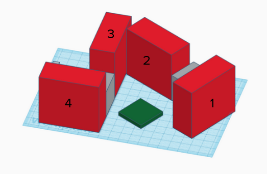
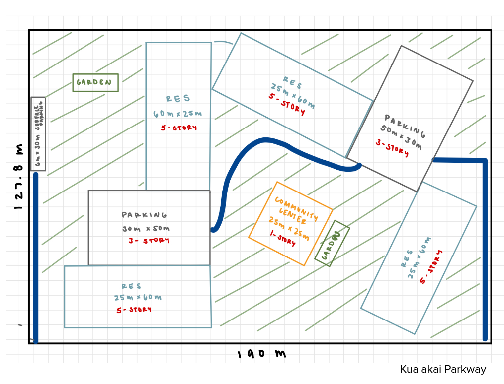

  
  

I worked on a team project with the Urban Land Institute (ULI) and Central Pacific Bank to create urban planning schematics for lower-income housing on the UH West Oahu grounds. Our goal was to design practical and affordable housing solutions that balanced financial feasibility with community needs. As part of the team, I contributed to developing the schematics by considering zoning requirements, accessibility, sustainability, and long-term livability. This collaboration gave me the chance to combine technical design with real-world considerations, while also learning from professionals in urban planning and finance.

Alongside creating the schematics, my team and I prepared and presented a Request for Proposal (RFP) for the project to investors, industry mentors, and public officials. This required us to clearly communicate the design, financial models, and community benefits in a way that connected technical details with larger social goals. Presenting as a team to such a diverse group of stakeholders taught me how to adapt my communication style, build confidence in professional settings, and see how design, policy, and finance intersect in real urban planning projects.

You can learn more about 
